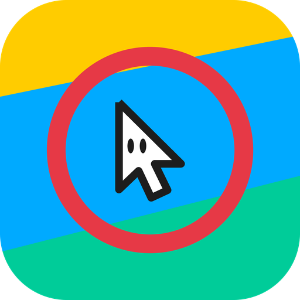

# cursor-ring

[](https://github.com/n-guitar/cursor-ring/actions/workflows/build.yml)

<p align="center">
  
</p>

**「ここに注目してほしい」をひと押しで示す。**
cursor-ring は、キーひとつでマウスポインタの周りにリングを表示し、いま話している場所を相手に
はっきり示せる macOS アプリです。画面共有・デモ・プレゼン・ライブコーディング・録画で、
見てほしい一点に視線を誘導できます。メニューバーに常駐し、Dock には出ません。

> 🇬🇧 English: [**README.md**](README.md)

## できること

- 🔵 **カーソルに追従するリング**をキー一つで表示 — 注目させたい場所を指し示す
- ⏱ **2通りの出し方**
  - **タップ**（ポンと押す）→ 出したまま。もう一度タップで消す
  - **長押し**（押しっぱなし）→ 押している間だけ表示
- 🖱 **その場で伸縮** — キーを押しながら2本指スクロール（上下＝縦、左右＝横）。リングを楕円に、四角を長方形に
- 🎨 **見た目を自由に** — 形（リング／四角）・色・横幅・縦幅・線の太さ
- ⌨️ **ショートカット変更可** — 好きなキー、F1 などの単独キーもOK
- 🪟 マルチディスプレイ対応 / 下のアプリのクリックを邪魔しない
- 🔒 **特別な権限は不要**（アクセシビリティ許可なしで動く）

> 対象: macOS 13 (Ventura) 以降

## インストール（Xcode 不要）

1. [**Releases**](https://github.com/n-guitar/cursor-ring/releases/latest) から最新の `CursorRing.zip` をダウンロードして展開
2. `CursorRing.app` を「アプリケーション」フォルダなどに移動
3. **初回だけ Gatekeeper に止められる**ので、どちらかで回避:
   - `CursorRing.app` を右クリック →「開く」→ ダイアログで「開く」
   - またはターミナルで `xattr -dr com.apple.quarantine /アプリのパス/CursorRing.app`

> 配布用に署名・公証（Notarization）はしていない個人利用向けビルドです。そのため初回だけ上の操作が要ります。

## 使い方

起動するとメニューバーにアイコンが出ます（Dock には出ません）。

1. **ショートカット（既定 ⌃⌥R、設定で変更可）**を押す
   - タップ → リングが出たまま。もう一度タップで消える
   - 長押し → 押している間だけ表示
2. **キーを押しながら2本指スクロール**でリングを伸縮（上下＝縦、左右＝横）。
   この操作中だけはスクロールが下のアプリ（ブラウザ等）に流れません
3. メニューバーアイコン →「設定…」で形・色・サイズ・ショートカットを変更

---

## 開発者向け

<details>
<summary>仕組み・ビルド・構成（クリックで展開）</summary>

### 技術概要

- Swift + SwiftUI（`MenuBarExtra` / 設定画面）+ AppKit（オーバーレイ描画・イベント監視）
- メニューバー常駐は `MenuBarExtra` + `LSUIElement=YES`（Dock 非表示）
- オーバーレイは透明・クリック透過・最前面の `NSWindow`
  - `.borderless` / `backgroundColor = .clear` / `isOpaque = false` / `ignoresMouseEvents = true` / `level = .screenSaver`
  - **ディスプレイごとに1枚**作るので、解像度/スケールが混在しても正しく描画。配置変更で作り直し
- 描画は `CAShapeLayer`（`CursorShapeView`）。形は `enum CursorShape { ring, square }`（縦横別指定で楕円・長方形）
- ショートカット検知は **Carbon `RegisterEventHotKey`**（`ShortcutMonitor`）→ **アクセシビリティ権限不要**
  - 「離した」検知は `CGEventSource.keyState` のポーリング（修飾キーを先に離すと Carbon の released が届かない場合があるため）
- 伸縮はキー押下中だけクリック透過を解除し、オーバーレイ自身が `scrollWheel` を消費（下のアプリに漏れない）
- マウス追従（`MouseTracker`）は `NSEvent` グローバル監視（マウス系は権限不要）
- 設定は `UserDefaults` に永続化（`AppSettings`）

### ビルド

```sh
open CursorRing.xcodeproj
```

⌘R で実行（ローカル実行なら署名は「Sign to Run Locally」でOK）。

push ごとに CI（`.github/workflows/build.yml`、macOS / Xcode 15.4、universal）がビルド。
`v*` タグ push か手動実行で `.github/workflows/release.yml` が `CursorRing.zip` を Release に添付する。

### アイコン

`design/icon.svg` がソース。`CursorRing/Assets.xcassets/AppIcon.appiconset` の各サイズ PNG は
SVG から生成している（差し替える場合は SVG を編集して各サイズを再生成）。

### ファイル構成

```
CursorRing/
  CursorRingApp.swift            @main / MenuBarExtra（メニュー）
  AppDelegate.swift              ショートカット→表示の配線（タップ/長押し/伸縮の状態管理）
  OverlayController.swift        ディスプレイ別オーバーレイ・カーソル追従・スクロール捕捉・設定反映
  OverlayWindow.swift            透明・クリック透過・最前面の NSWindow
  CursorShapeView.swift          CAShapeLayer でリングを描く（スクロール消費もここ）
  CursorShape.swift              形の enum（パス差し替え）
  MouseTracker.swift             NSEvent によるカーソル追従
  ShortcutMonitor.swift          Carbon RegisterEventHotKey（権限不要）
  AppSettings.swift              設定の保持・永続化（UserDefaults）
  SettingsView.swift             設定画面（SwiftUI）
  SettingsWindowController.swift 設定ウィンドウ管理（AppKit）
  NSColor+Hex.swift              色の保存用 hex 変換
```

### 未着手

- 配布用の署名・Notarization（Apple Developer 登録が必要）

</details>
